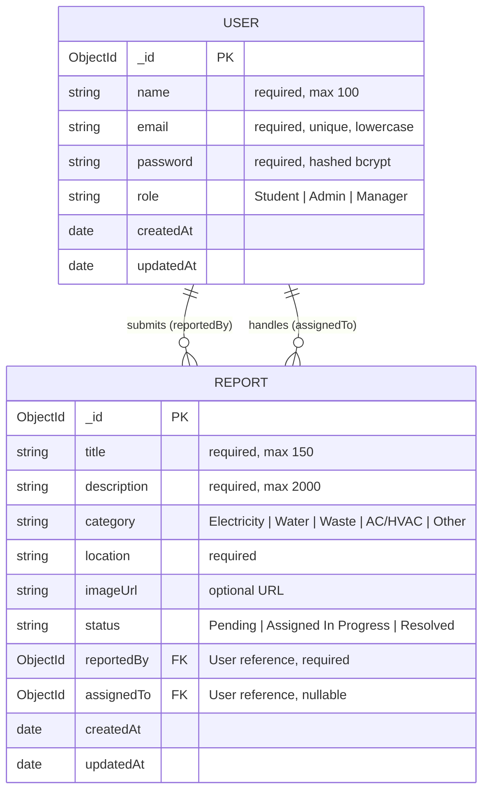

# EcoCampus MongoDB Database Schema & Architecture

Comprehensive database schema reference, data dictionaries, relationship diagrams, and index design for the **EcoCampus** platform.

---

## 1. Entity-Relationship Diagram (ERD)



---

## 2. Collection Specifications

### 2.1 `users` Collection

Stores account profiles, credentials, and RBAC authority levels.

| Field | Type | Required | Unique | Default | Validation / Notes |
|---|---|---|---|---|---|
| `_id` | `ObjectId` | Auto | Yes | Auto | MongoDB primary key |
| `name` | `String` | Yes | No | None | Trimmed, Max 100 chars |
| `email` | `String` | Yes | Yes | None | Lowercase, valid RFC 5322 regex match |
| `password` | `String` | Yes | No | None | Min 6 characters; automatically salted and hashed via bcryptjs (`pre('save')`); excluded from standard queries via `select: false` |
| `role` | `String` | Yes | No | `'Student'` | Enum: `['Student', 'Admin', 'Manager']` |
| `createdAt` | `Date` | Auto | No | Auto | ISO 8601 timestamp |
| `updatedAt` | `Date` | Auto | No | Auto | ISO 8601 timestamp |

#### User Model Methods:
- `matchPassword(candidatePassword)`: Asynchronous bcrypt compare method returning boolean.

---

### 2.2 `reports` Collection

Stores sustainability incident tickets, environmental defects, and workflow status.

| Field | Type | Required | Unique | Default | Validation / Notes |
|---|---|---|---|---|---|
| `_id` | `ObjectId` | Auto | Yes | Auto | MongoDB primary key |
| `title` | `String` | Yes | No | None | Trimmed, Max 150 chars |
| `description` | `String` | Yes | No | None | Trimmed, Max 2000 chars |
| `category` | `String` | Yes | No | None | Enum: `['Electricity', 'Water', 'Waste', 'AC/HVAC', 'Other']` |
| `location` | `String` | Yes | No | None | Specific room, building or floor |
| `imageUrl` | `String` | No | No | `""` | Optional URL pointing to photo evidence |
| `status` | `String` | Yes | No | `'Pending'` | Enum: `['Pending', 'Assigned In Progress', 'Resolved']` |
| `reportedBy` | `ObjectId` | Yes | No | None | Refers to `User._id` |
| `assignedTo` | `ObjectId` | No | No | `null` | Refers to `User._id` (Facilities Manager/Admin) |
| `createdAt` | `Date` | Auto | No | Auto | ISO 8601 timestamp |
| `updatedAt` | `Date` | Auto | No | Auto | ISO 8601 timestamp |

---

## 3. Database Indexes & Query Optimization

To maintain sub-millisecond query latencies across large campus issue logs, the following indexes are declared in Mongoose:

```javascript
// Unique email index for fast auth lookups and constraint enforcement
userSchema.index({ email: 1 }, { unique: true });

// Compound index on Report collection for fast filtering by status & category, sorted by creation date
reportSchema.index({ status: 1, category: 1, createdAt: -1 });

// Single-field index for reporter-specific ticket lookups
reportSchema.index({ reportedBy: 1 });
```

---

## 4. Data Security & Integrity Standards

1. **Password Protection:** Passwords are never stored in plaintext. They undergo one-way hashing with salt rounds = 10 via `bcryptjs`.
2. **Field Sanitization:** Inputs are trimmed, lowercase-enforced (for emails), and checked against rigid enum arrays before database persistence.
3. **Reference Population:** Foreign keys (`reportedBy`, `assignedTo`) populate only public user attributes (`name`, `email`, `role`), ensuring password hashes are never leaked in API payloads.
